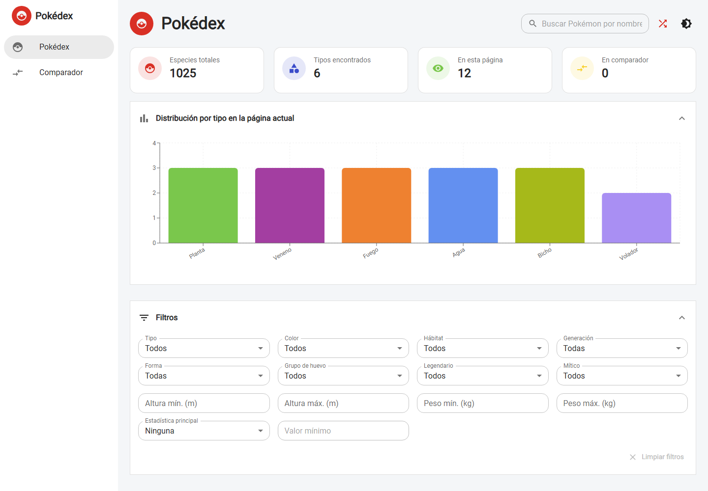
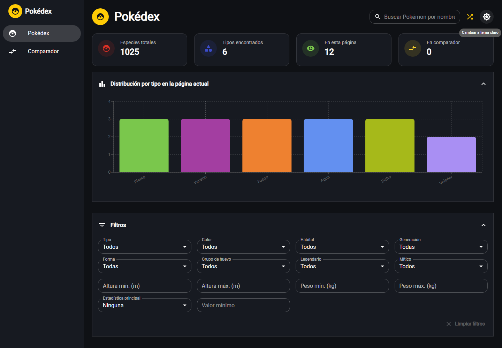
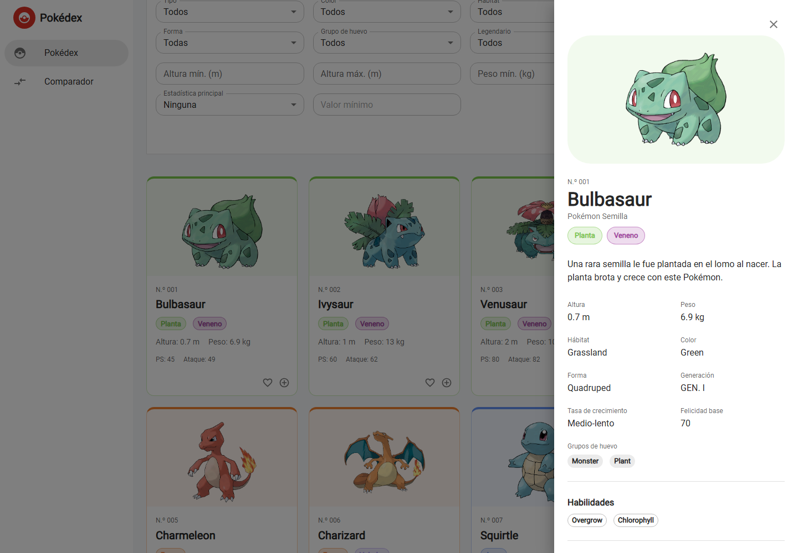
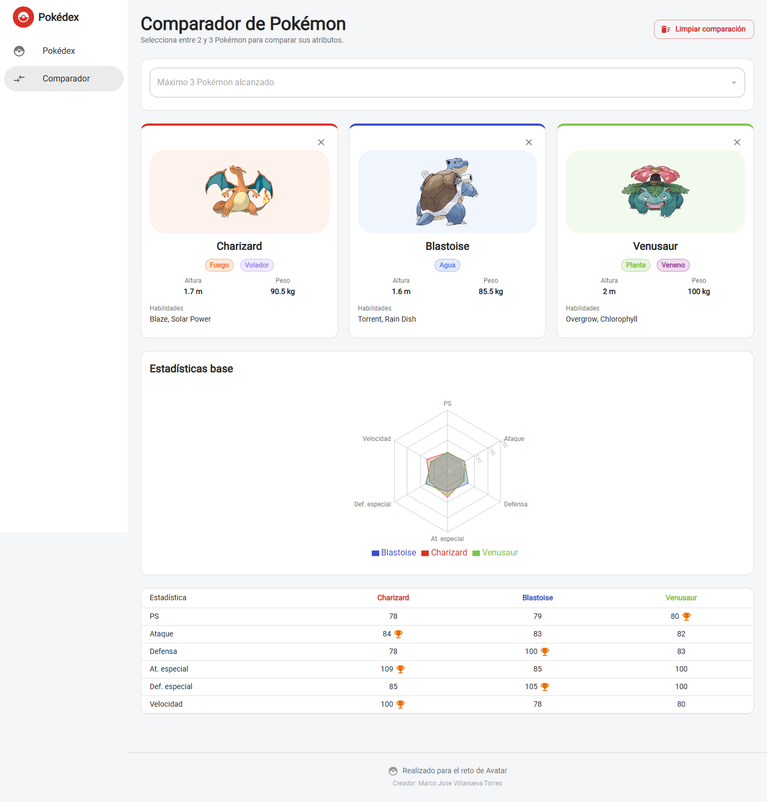
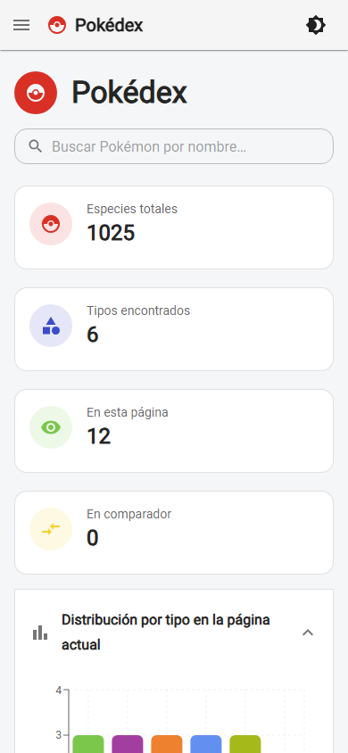

# Pokédex & Comparador

Dashboard que consume [PokéAPI](https://pokeapi.co/) para listar, filtrar, comparar y
visualizar Pokémon. React + TypeScript + Material UI.

## Capturas

| Pokédex (tema claro) | Pokédex (tema oscuro) |
|---|---|
|  |  |

| Detalle de un Pokémon | Comparador |
|---|---|
|  |  |



## Stack

| Categoría | Tecnología |
|---|---|
| UI | React 19 + TypeScript (estricto) |
| Bundler | Vite |
| Componentes | Material UI, tema claro/oscuro centralizado |
| Ruteo | React Router |
| Datos remotos | TanStack Query |
| HTTP | Axios |
| Estado local | Zustand (`localStorage`) |
| Gráficos | Recharts |
| Animaciones | Framer Motion |
| Formularios | React Hook Form |
| Notificaciones | Notistack |
| Pruebas | Vitest + Testing Library |
| Lint / formato | ESLint + Prettier |

## Arquitectura

```
src/
  aplicacion/     Composición de la app, límite de errores global
  componentes/    Componentes compartidos entre módulos
  configuracion/  Entorno, QueryClient, setup de pruebas
  constantes/     Colores por tipo, rutas de la API, traducciones
  contextos/      Tema y stores de Zustand (comparador, favoritos)
  hooks/          Hooks reutilizables
  modelos/        Tipos de la API cruda y del dominio
  modulos/
    pokedex/      Componentes, hooks y utilidades del módulo Pokédex
    comparador/   Componentes y hooks del módulo Comparador
  paginas/        Páginas por ruta
  rutas/          Definición de rutas
  servicios/      Cliente HTTP, servicios por recurso, transformadores
  tema/           Tema de Material UI
  utilidades/     Funciones auxiliares puras
```

Los componentes no llaman a la API directamente: consumen hooks (`usePaginaPokedex`,
`usePokemonDetalle`, `useCatalogosFiltros`...) que a su vez usan `servicios/`.

## Uso

```bash
npm install
npm run dev          # http://localhost:5173
npm run build        # build de producción en dist/
npm run preview      # sirve el build
npm run lint
npm run format
npm run test         # una vez
npm run test:watch
```

Requiere Node 20+.

## Notas técnicas

- **Filtros por agrupación + exploración progresiva.** Tipo, color, hábitat, generación,
  forma y grupo de huevo se resuelven contra los endpoints de agrupación de PokéAPI
  (`/type/{n}`, `/pokemon-color/{n}`, etc.), intersectados en memoria con un índice
  liviano de todas las especies. Altura, peso, estadística, legendario y mítico dependen
  de `/pokemon` por individuo, así que se exploran en detalle solo los primeros 150
  candidatos que ya cumplen los demás filtros; si el conjunto es más grande, el total se
  muestra como aproximado.
- **Catálogos de filtros en vivo.** Las opciones de tipo/color/hábitat/forma/grupo de
  huevo/generación se traen de los endpoints de lista de PokéAPI y se cachean
  indefinidamente (`useCatalogosFiltros`); solo la etiqueta visible está traducida
  (`constantes/traduccionesFiltros.ts`). El slug que se envía siempre es el que devuelve
  la API.
- **Resolución por especie, no por variedad.** `/pokemon/{nombre}` no siempre coincide
  con el nombre de la especie (`tatsugiri` → `tatsugiri-curly`). `obtenerPokemonDetalle`
  pide primero `/pokemon-species/{nombre}` y usa la URL de su variedad `is_default`. El
  identificador que se guarda en comparador y favoritos es el de la especie.
- **Reintentos solo en errores transitorios.** Un 4xx no se reintenta (el recurso no
  existe, reintentar no cambia nada); solo errores de red o 5xx. El interceptor de Axios
  deja pasar las cancelaciones sin transformarlas para que no se traten como error.
- **Filtros y paginación en la URL**, vía `useFiltrosPokedexUrl` — el estado de búsqueda
  es compartible/recargable.
- **Comparador y favoritos en Zustand con `persist`**, sobreviven a recargas de página.

## Funcionalidades

**Pokédex** — búsqueda con debounce, indicadores en vivo (especies totales, tipos en la
página, en comparador), gráfico de distribución por tipo, filtros por nombre/tipo/color/
hábitat/generación/forma/grupo de huevo/altura/peso/estadística/legendario/mítico,
paginación real con `limit`/`offset`, grilla de tarjetas y panel de detalle completo
(estadísticas, habilidades, descripción, cadena evolutiva, variedades).

**Comparador** — hasta 3 Pokémon, tipos/altura/peso/habilidades, radar de estadísticas,
tabla comparativa con el valor más alto resaltado, validación de duplicados, persistencia
en `localStorage`.

**Transversal** — skeletons, estados de vacío/error con reintento, snackbars, barra de
progreso global, controles deshabilitados durante una petición en curso, tema claro/oscuro,
diseño responsive, accesibilidad (ARIA, foco visible, navegación por teclado).

## Pruebas

Cubren: renderizado del listado, búsqueda por nombre, aplicación/limpieza de filtros,
estados de carga y error, agregar al comparador, prevención de duplicados y
transformación de respuestas de PokéAPI al modelo de dominio.
